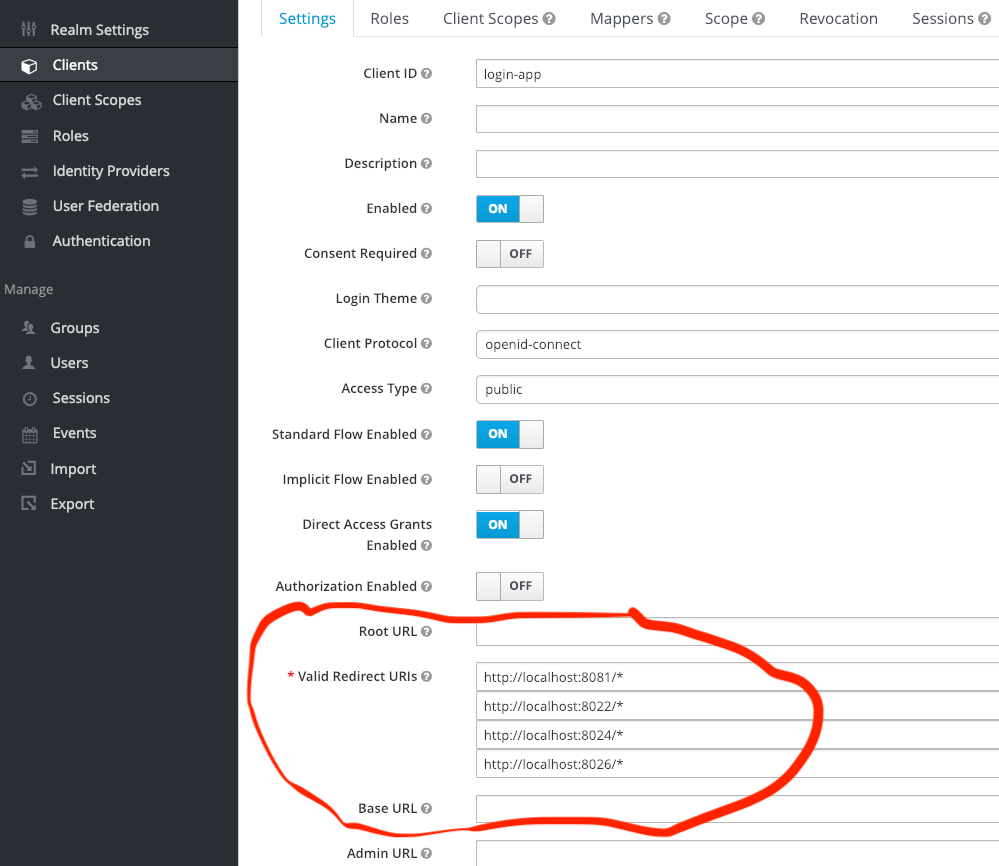

 LearnMake KEYCLOAK  
====================  

Baseline setup with reference-apps using [KEYCLOAK](https://www.keycloak.org)!  
See also [medium-article](https://link.medium.com/lRMDMXgNJT)        

## LEARN - MAKE - SHOW - SHARE   

### Prerequisites

In order to build and run this app you need to have a couple of things installed:  

- The Docker Toolbox or native Docker, whatever you prefer. See [Docker](https://docs.docker.com) and [Docker-Compose](https://docs.docker.com/compose/)  
- *(for dev)* An IDE for the development, like [Atom](https://atom.io) or [IntelliJ](https://www.jetbrains.com/idea/)    
- *(for dev)* [Node.js](https://nodejs.org/), [npm](https://www.npmjs.com/), and [Yarn](https://yarnpkg.com) installed, _see [package.json](package.json) for the required versions._        
- *(for dev)* Get familiar with _[VueJS](https://vuejs.org/)._  
- *(for dev)* Get familiar with [Spring Boot](https://www.baeldung.com/spring-boot)                          
         

### Keycloak instance with Docker    

Building and running via _Docker_ and _Docker-Compose_:         
```bash   
$ docker-compose up --build   

  # NOTE: in linux-env you might have permission problems with 'docker-data-*' folders      
  # to fix; stop docker-compose, set permissions as below, then run docker-compose again.    
$ sudo chown 1001:1001 -R docker-data-*  

  # to shut it down, ctrl+c and   
$ docker-compose down   
```
`docker-compose up` gets Keycloak instance up and running in your local environment.    
Now you can access Keycloak admin panel via [http://localhost:8081](http://localhost:8081)      
the default *admin username+passwd* is inside [docker-compose.yaml](docker-compose.yaml)    

After you login, you need to setup a Realm and Client!  
NB! By default, *docker-compose* while starting should also reimport [default config](config/) like *realm, client and users*.  

If you still want to do this manually:  
To learn more about creating a realm/clients/users, see [https://www.keycloak.org/docs/latest/server_admin/index.html#admin-console](https://www.keycloak.org/docs/latest/server_admin/index.html#admin-console)  
p.s. You can also reuse the first part of [baeldung-tutorial](https://www.baeldung.com/spring-boot-keycloak)*.       
      
Here is just an outline of what you need to do for running these examples:  

- create a realm named `KeycloakExampleApp`    
- turn off the requirement of ssl for this realm *(realmsettings -> login -> require ssl -> none)*     
- create a client named `login-app` with default Client ID `openid-connect` and *AccessType* as `public`. And also set *Valid Redirect URIs* as `http://localhost:8081/*` which is the base URI of keycloak server.                
- create a *user* Role *(Roles -> add role)*    
- create a user named `myuser` with password `mypass` *(Users -> add user)*. Make sure to activate, *Role Mapping* to `user`role.      

the resulting `keycloak.json` should yield:  
```json
{
  "realm": "KeycloakExampleApp",
  "auth-server-url": "http://localhost:8081/auth",
  "ssl-required": "none",
  "resource": "login-app",
  "public-client": true,
  "confidential-port": 0
}
```

NB! Client settings requires *Valid Redirect URIs* for each of the reference-app, see    

After you've done all the config, now you can use Reference Apps which are listed below.   

### Separately building & running Reference Apps  
See list of reference implementations  
- [KEYCLOAK using Spring Boot](keycloak-springboot)    
- [KEYCLOAK using Node.js/Vue.js](keycloak-vuejs)  
- [KEYCLOAK using Golang](keycloak-golang)   
- *more...MiP...*      


